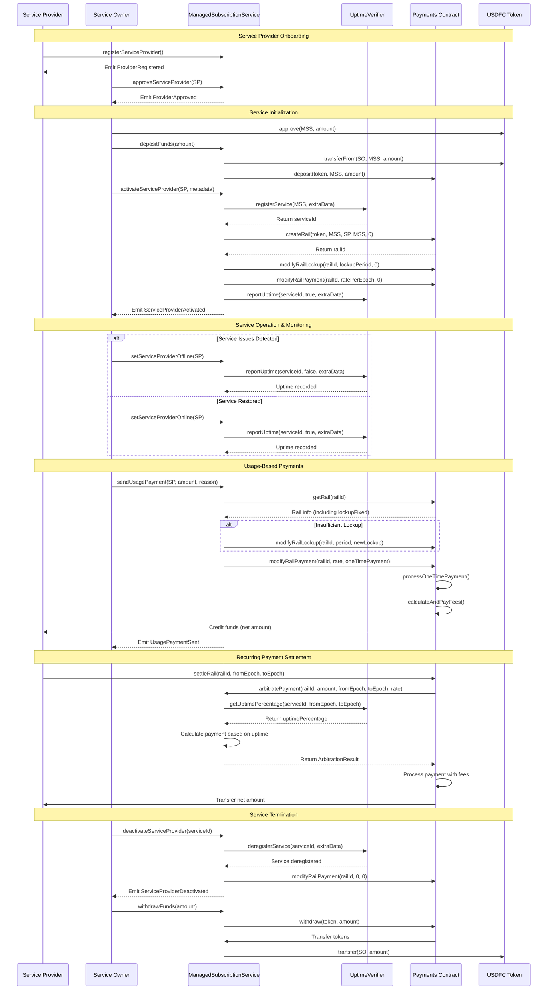

# ManagedSubscriptionService

## User Contract Flow

```mermaid
sequenceDiagram
    participant SP as Service Provider
    participant SO as Service Owner
    participant MSS as ManagedSubscriptionService
    participant UV as UptimeVerifier
    participant P as Payments Contract
    participant Token as USDFC Token

    Note over SP,Token: Service Provider Onboarding
    SP->>MSS: registerServiceProvider()
    MSS-->>SP: Emit ProviderRegistered
    
    SO->>MSS: approveServiceProvider(SP)
    MSS-->>SO: Emit ProviderApproved
    
    Note over SP,Token: Service Initialization
    SO->>Token: approve(MSS, amount)
    SO->>MSS: depositFunds(amount)
    MSS->>Token: transferFrom(SO, MSS, amount)
    MSS->>P: deposit(token, MSS, amount)
    
    SO->>MSS: activateServiceProvider(SP, metadata)
    MSS->>UV: registerService(MSS, extraData)
    UV-->>MSS: Return serviceId
    MSS->>P: createRail(token, MSS, SP, MSS, 0)
    P-->>MSS: Return railId
    MSS->>P: modifyRailLockup(railId, lockupPeriod, 0)
    MSS->>P: modifyRailPayment(railId, ratePerEpoch, 0)
    MSS->>UV: reportUptime(serviceId, true, extraData)
    MSS-->>SO: Emit ServiceProviderActivated
    
    Note over SP,Token: Service Operation & Monitoring
    alt Service Issues Detected
        SO->>MSS: setServiceProviderOffline(SP)
        MSS->>UV: reportUptime(serviceId, false, extraData)
        UV-->>MSS: Uptime recorded
    else Service Restored
        SO->>MSS: setServiceProviderOnline(SP)
        MSS->>UV: reportUptime(serviceId, true, extraData)
        UV-->>MSS: Uptime recorded
    end
    
    Note over SP,Token: Usage-Based Payments
    SO->>MSS: sendUsagePayment(SP, amount, reason)
    MSS->>P: getRail(railId)
    P-->>MSS: Rail info (including lockupFixed)
    
    alt Insufficient Lockup
        MSS->>P: modifyRailLockup(railId, period, newLockup)
    end
    
    MSS->>P: modifyRailPayment(railId, rate, oneTimePayment)
    P->>P: processOneTimePayment()
    P->>P: calculateAndPayFees()
    P->>SP: Credit funds (net amount)
    MSS-->>SO: Emit UsagePaymentSent
    
    Note over SP,Token: Recurring Payment Settlement
    SP->>P: settleRail(railId, fromEpoch, toEpoch)
    P->>MSS: arbitratePayment(railId, amount, fromEpoch, toEpoch, rate)
    MSS->>UV: getUptimePercentage(serviceId, fromEpoch, toEpoch)
    UV-->>MSS: Return uptimePercentage
    MSS->>MSS: Calculate payment based on uptime
    MSS-->>P: Return ArbitrationResult
    P->>P: Process payment with fees
    P->>SP: Transfer net amount
    
    Note over SP,Token: Service Termination
    SO->>MSS: deactivateServiceProvider(serviceId)
    MSS->>UV: deregisterService(serviceId, extraData)
    UV-->>MSS: Service deregistered
    MSS->>P: modifyRailPayment(railId, 0, 0)
    MSS-->>SO: Emit ServiceProviderDeactivated
    
    SO->>MSS: withdrawFunds(amount)
    MSS->>P: withdraw(token, amount)
    P->>MSS: Transfer tokens
    MSS->>Token: transfer(SO, amount)
```